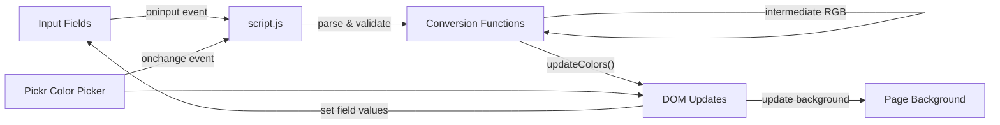

# Color Converter

[](https://github.com/lilter96/color_converter/actions/workflows/ci.yml)
[](https://developer.mozilla.org/en-US/docs/Web/JavaScript)
[](https://developer.mozilla.org/en-US/docs/Web/CSS)

**Real-time color format converter in the browser.** Convert between HEX, RGB, CMYK, HSV, and HSL instantly as you type. Includes a visual color picker, live background preview, and a whimsical CSS-animated moon with an orbiting rocket.

---

## Overview

Color Converter is a single-page, zero-dependency web tool that converts colors between five formats in real time. Type into any input field — HEX, RGB, CMYK, HSV, or HSL — and the other four update immediately. A Pickr color picker provides visual color selection, and the page background updates live to match. The UI features a decorative CSS-only animation of a moon with craters and a rocket in orbit.

Built with vanilla JavaScript, HTML5, and CSS3 — no frameworks, no build step, no npm. Just open `index.html` in a browser.

---

## Architecture



### Conversion Chain

All formats convert through an **intermediate RGB representation**:

```
HEX ──→ RGB ──┬──→ HEX
RGB ──────────┤
CMYK ──→ RGB ─┤──→ HSV
HSV ───→ RGB ─┤──→ HSL
HSL ───→ RGB ─┘──→ CMYK
```

The `updateColors()` function broadcasts the current RGB value to all five output functions, which populate their respective input fields and update the Pickr color picker.

---

## Features

- **5 color formats** — HEX, RGB, CMYK, HSV, HSL — all in one view
- **Real-time conversion** — type in any field, see all others update instantly
- **Flexible input** — accepts both function-notation (`rgb(255,0,0)`) and raw values (`255,0,0`)
- **Validation with visual feedback** — invalid inputs turn red; affected fields zero out
- **Pickr color picker** — hue slider + preview for visual color selection
- **Live background preview** — page background changes to match the selected color
- **CSS moon animation** — purely decorative moon with craters and orbiting rocket (no JS needed)

---

## Tech Stack

| Component | Technology |
|---|---|
| Logic | Vanilla JavaScript (ES5+) |
| Markup | HTML5 |
| Styling | CSS3 (animations, responsive) |
| Color Picker | Pickr (CDN) |
| Font | Poppins (Google Fonts) |
| Dependencies | None (zero npm packages) |

---

## Getting Started

No build step required. Just open the file:

```bash
git clone https://github.com/lilter96/color_converter.git
cd color_converter/src/html
open index.html
```

Or serve with any static file server:

```bash
npx serve color_converter/src/html
```

---

## Supported Input Formats

| Format | Example Input | Range |
|---|---|---|
| HEX | `#ff5733` or `FF5733` | 000000–FFFFFF |
| RGB | `rgb(255, 87, 51)` or `255, 87, 51` | 0–255 per channel |
| CMYK | `cmyk(0, 66, 80, 0)` or `0, 66, 80, 0` | 0–255 per channel |
| HSV | `hsv(12, 80, 100)` or `12, 80, 100` | H: 0–360, S/V: 0–100 |
| HSL | `hsl(12, 100, 60)` or `12, 100, 60` | H: 0–360, S/L: 0–100 |

---

## Design Decisions

### 1. Vanilla JavaScript over a framework
**Choice:** Zero dependencies, no React/Vue/Svelte, no npm, no build step.
**Why:** The app has one job — convert colors between formats when an input changes. That's three event handlers, five conversion functions, and DOM updates. Introducing a framework for this would be dramatically more complex than the problem itself. The entire logic fits in one readable file (`script.js`, ~200 lines).

### 2. RGB as the intermediate format
**Choice:** All conversions go through RGB as an intermediate representation.
**Why:** RGB is the common denominator — every color format has a well-defined conversion to and from RGB. Converting through a single pivot format means N×2 conversion functions instead of N×(N-1) direct conversions. Adding a 6th format in the future would require only two new functions (toRGB and fromRGB), not five.

### 3. Regex validation with red-text feedback over browser-native validation
**Choice:** Each input field has a regex pattern checked on every `oninput` event. Invalid values turn red and zero out dependent fields.
**Why:** Browser-native form validation (`pattern` attribute + `:invalid` CSS) only triggers on form submission, not on every keystroke. For a real-time converter, instant feedback is essential — the user should know immediately that `"abc"` isn't a valid HEX color. The trade-off is slightly more JS code in exchange for a much better UX.

### 4. Pickr over `<input type="color">`
**Choice:** Use the Pickr library for the color picker instead of the browser's built-in color input.
**Why:** The native `<input type="color">` varies wildly across browsers and platforms (some only show a swatch, some show OS-level pickers). Pickr provides a consistent, customizable experience with just a hue slider and preview — exactly what a color converter needs. It's loaded from CDN (no build dependency) and adds ~30KB gzipped.

### 5. CSS-only decorative animation over JS-based animation
**Choice:** The moon + rocket animation is implemented entirely in CSS (`@keyframes spin` on the orbit container).
**Why:** CSS animations are GPU-accelerated (composited on a separate thread), consume no JavaScript main-thread time, and work even with JS disabled. The rocket orbiting the moon is a visual flourish that adds personality without affecting the tool's functionality. Keeping it in CSS means the JS stays focused on the actual color conversion logic.

---

## Author

**Terentiy Gatsukov** — [GitHub](https://github.com/lilter96)
